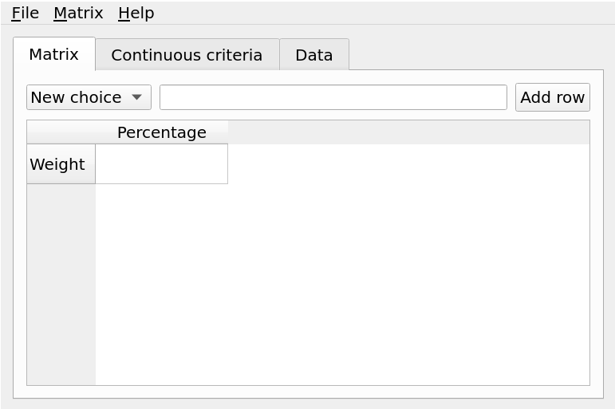

# Decision matrix qt

The front end interface to [decision-matrix-py](https://github.com/twenty5151/decision-matrix-py). Written in Python using the Qt framework.

Note: I've realized that using a table isn't the best abstractation for the general user. The wizard (accessible with ctrl+a or Matrix -> Assistant) is the ideal interface and the best abstractation level.

The only reason why I used Qt is because Gtk doesn't have a user-editable table widget. Qt can either be written C++ or Python; which makes the choice obvious. As it's no longer needed, I plan to use gtk.

Now, using gtk opens up a lot more possibilities. The API and the GUI can be rewritten in a language that can be statically compiled to make distribution even possible. (PyInstaller would have to bundle in numpy, pandas, scipy, and matplotlib -- yikes!)

## Installation

* git clone
* `pip install PySide2`  (use conda if it fails)
* Run with `python -m gui`
